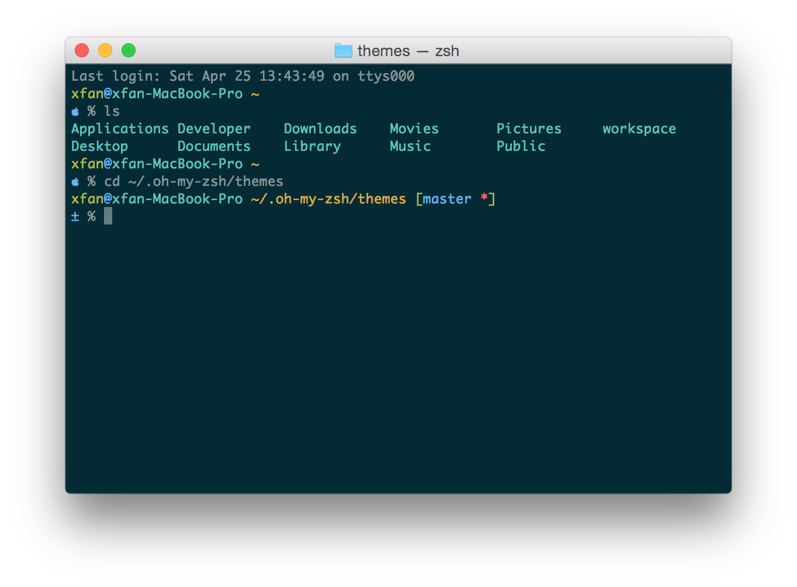

# Zsh Theme: blinks-xfan

### What's this?

**blinks-xfan** is a zsh theme for [oh-my-zsh](https://github.com/robbyrussell/oh-my-zsh). Modified based on the existing theme **blinks**.

Changed list:
* Removed right prompt
* Removed highlight background of prompt
* Add  

### Usage

1. Put `blinks-xfan.zsh-theme` in the `themes/` directory in the on-my-zsh distribution.
2. Set `ZSH_THEME` to the name of the theme in your `~/.zshrc`.

### Preview

